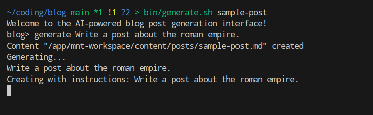

This program is a command-line interface (CLI) that generates blog posts using AI-powered models. It allows users to interact with the program through a series of commands, which can be used to generate, extend, and summarize blog posts.

**Program Structure**

The program consists of several components:

1. **Argument Parsing**: The `argparse` module is used to parse command-line arguments.
2. **Blog Post Generation Interface**: This is the main interface that users interact with. It provides a series of commands (generate, extend, summarize) that allow users to generate, extend, and summarize blog posts.
3. **Agents**: These are AI-powered models that generate responses based on user input. There are three agents:
	* `BlogAgent`: Generates a blog post from scratch.
	* `ExtendAgent`: Extends an existing blog post with more content.
	* `SummaryAgent`: Generates a summary of an existing blog post.

**Commands**

The program provides the following commands:

1. **generate**: Generates a new blog post using the `BlogAgent`.
2. **extend**: Extends an existing blog post using the `ExtendAgent`.
3. **summarize**: Generates a summary of an existing blog post using the `SummaryAgent`.
4. **bye**: Exits the program.

**Program Flow**

Here is an overview of how the program flows:

1. The user starts the program by running it from the command line.
2. The program parses the command-line arguments and initializes the blog post generation interface.
3. The user interacts with the program using one of the available commands (generate, extend, summarize).
4. The program uses the corresponding agent to generate a response based on the user's input.
5. The program updates the blog post with the generated content and saves it to disk.
6. The program continues running until the user exits using the `bye` command.

**Requirements**

This program requires:

1. Python 3.x
2. The `argparse` module
3. The `ollama` library 

**Screenshots**



**Result**

```Markdown
+++
title = "Sample Post"
date = 2024-08-07 20:59:22+00:00
draft = true
+++
# The Roman Empire: A Lasting Legacy
==============================

## Introduction
------------

The Roman Empire was one of the most powerful and influential civilizations in human history. Spanning over 12 centuries, it left an indelible mark on the world, shaping politics, architecture, law, and culture as we know them today.

## Rise to Power
----------------

Founded by Romulus and Remus in 753 BCE, Rome began as a small city-state, gradually expanding its territories through conquests and strategic alliances. By the 1st century BCE, it had become a dominant force in the Mediterranean, with a vast network of roads, bridges, and aqueducts that facilitated trade and communication.

## Governance
------------

The Roman Empire was ruled by a system of governance that evolved over time. The Senate, composed of noble patricians, advised the Emperor on matters of state, while the Magistrates oversaw administrative functions. Later, the Emperor became the supreme authority, with absolute power to make laws and govern.

## Cultural Achievements
-----------------------

Roman culture flourished in various aspects:

*   Architecture: The iconic Colosseum, Pantheon, and Forum Romanum showcased their engineering prowess.
*   Law: The Twelve Tables established a foundation for modern law, influencing the development of European legal systems.
*   Language: Latin became the lingua franca, shaping the Romance languages that followed.

## Legacy
----------

The Roman Empire's impact on world history is profound:

*   Spread of Christianity: Rome played a significant role in the spread of early Christianity throughout Europe and beyond.
*   Rise of Modern States: The Roman Empire's territorial expansion and administrative structures influenced the development of modern nation-states.
*   Cultural Exchange: Roman trade, architecture, art, and literature continue to inspire and inform contemporary cultures.

## Conclusion
-------------

The Roman Empire's enduring legacy testifies to its significance in shaping global politics, culture, and values. Its contributions continue to influence our world today, making it an essential topic of study and reflection for anyone interested in history and human civilization.
```